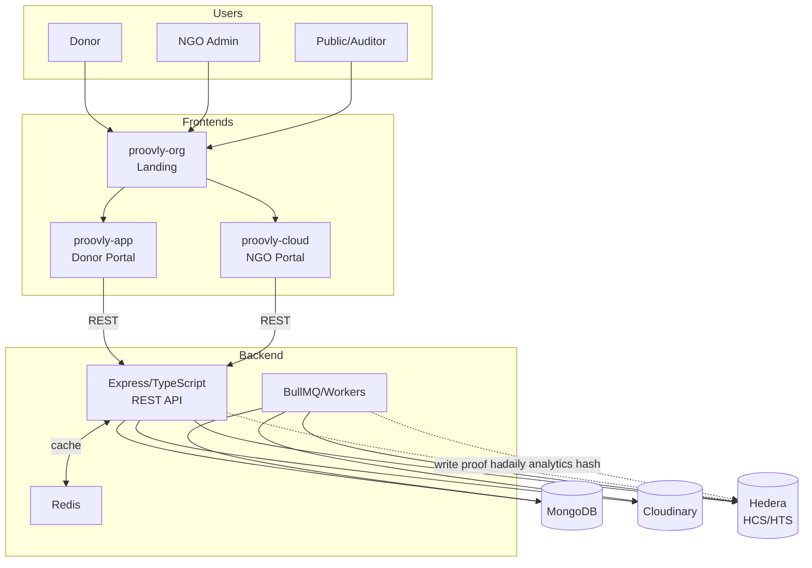

# Proovly

One line: Verifiable donation transparency for donors and NGOs, powered by Hedera (HCS/HTS) with media proofs and analytics.

## Problem Statement

Trust in donations is fragile. Donors want verifiable impact, NGOs need simple tools to prove delivery, and auditors require canonical, immutable records. Traditional systems are siloed, opaque, and media evidence is rarely tamper-evident.

## Solution Overview

Proovly is a 4-part system:
- proovly-org (Landing): Explains the platform, routes users to the right portal, and surfaces public analytics.
- proovly-app (Donor Portal): Create and track donations with real-time status and proofs.
- proovly-cloud (NGO Portal): Operate donations, upload proof media, assign/mark delivered, run analytics and ingestion.
- backend (API): Central source of truth with JWT auth, state machine enforcement, Hedera integration (HCS/HTS), media, analytics, and jobs.

Key features:
- Verifiable delivery: Hashes and HCS logs for proofs; optional media persisted with secure, signed uploads (Cloudinary).
- Secure workflow: Pending → Funded → Assigned → Delivered, enforced with role-based guards.
- Analytics: Cached summaries, chain-backed daily hashes, optional CSV/SQL ingestion via workers.
- Dual upload modes: Backend proxy or direct browser-to-Cloudinary (HMAC signature endpoint).


## Architecture (with Hedera) 



## System Stats

- Backend tests: 28/28 passing, 51 tests passed, 61.2% branch coverage
- Frontends: Next.js 15/16 + React 19
- Media: Cloudinary (direct upload + proxy), signatures via HMAC-SHA256
- State machine: pending → funded → assigned → delivered with role guards

## Setup Instructions

Prereqs:
- Node.js 18+
- pnpm (recommended) or npm
- MongoDB, Redis (dev/local or cloud) — or use defaults from .env

Clone and install:
```bash
git clone https://github.com/Mohammed-Ehap-Ali-Zean-Al-Abdin/Proovly.git
cd Proovly

# Install all workspaces (recommended with pnpm)
pnpm install --filter ./backend --filter ./proovly-app --filter ./proovly-cloud --filter ./proovly-org
```

Environment (minimal):
- backend/.env
	- PORT=4000
	- MONGODB_URI=...
	- JWT_SECRET=...
	- CLOUDINARY_CLOUD_NAME, CLOUDINARY_API_KEY, CLOUDINARY_API_SECRET
	- HEDERA_ACCOUNT_ID, HEDERA_PRIVATE_KEY, HCS_TOPIC_ID (optional, created on demand)
- proovly-app/.env.local
	- NEXT_PUBLIC_API_URL=http://localhost:4000/api/v1
- proovly-cloud/.env.local
	- NEXT_PUBLIC_API_URL=http://localhost:4000/api/v1
- proovly-org/.env.local
	- NEXT_PUBLIC_DONOR_PORTAL_URL=http://localhost:3000
	- NEXT_PUBLIC_NGO_PORTAL_URL=http://localhost:3001
	- NEXT_PUBLIC_API_DOCS_URL=http://localhost:4000/api-docs
	- NEXT_PUBLIC_API_URL=http://localhost:4000/api/v1

Run locally (suggested ports):
```bash
# Backend (http://localhost:4000)
cd backend && pnpm dev

# Donor Portal (http://localhost:3000)
cd ../proovly-app && pnpm dev

# NGO Portal (http://localhost:3001)
cd ../proovly-cloud && pnpm dev

# Landing (http://localhost:3002)
cd ../proovly-org && PORT=3002 pnpm dev
```

## API Docs (Swagger)

Swagger UI is served from the backend:
- Local: http://localhost:4000/api-docs

Selected endpoints:
- Auth: POST /api/v1/auth/signup, POST /api/v1/auth/login
- Donations: CRUD + PATCH status with state validation; POST /donations/:id/deliver (hash + mediaUrl)
- Media: POST /media/upload (auth), POST /cloudinary/signature (auth)
- Analytics: GET /analytics/summary, POST /analytics/generate-daily-hash, contract get/put hash
- OFD: /ofd, /ofd-records, /ofd/positions
- Ingestion: POST /ingest/csv, POST /ingest/sql

## Hedera Implementation Details

- HCS (Consensus Service):
	- Daily analytics hash writes (CSV summary → SHA-256 → HCS message)
	- Delivery proof logs via `HedTxLog` with mirror URL references
- HTS (Token Service):
	- Minimal OFD flow (mint/transfer) for proof-of-concept
- All writes are best-effort with graceful degradation if Hedera is unavailable in dev

## Future Roadmap

- Time-series analytics endpoint to power real trends on the landing dashboard
- Regional/geospatial analytics + map visualizations
- Donor-side receipts with QR-verifiable proof bundles
- NGO onboarding flows and SSO (Google/Microsoft)
- Moderation/verification workflows for media
- CI/CD, infra as code, one-command local orchestration
- Accessibility sweeps and performance budgets

## Contributing & Tests

Run backend tests:
```bash
cd backend && pnpm test
```

Contributions welcome via PRs. Please ensure tests pass and lint rules are respected.

